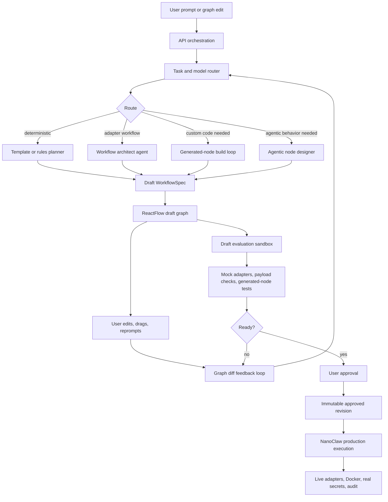
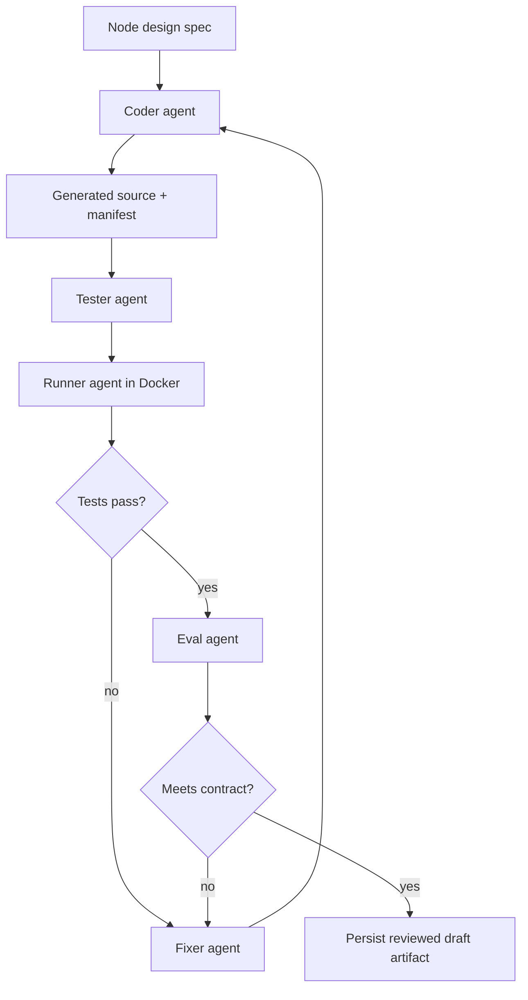

# FINAL PHASE: Agentic Workflow Architecture And Draft-Time Evaluation

## Goal

Upgrade KelpClaw from a production-capable workflow planner/executor into a workflow-building system with explicit task routing, agentic code generation, draft-time evaluation, bounded debugging loops, live progress streaming, and a clear separation between safe draft exploration and approved production execution.

The system must stay workflow-native. It should borrow useful architecture from app-builder agent systems without turning KelpClaw into an app builder. KelpClaw's primary artifact remains a workflow graph, approved workflow revision, generated node artifact, integration configuration, or deployable workflow activation.

## Current Gaps

Phase 8 made KelpClaw production-capable, but it did not add a sophisticated model router or multi-agent build loop.

Known gaps:

- Model selection is configurable but not optimized by task type.
- Code generation is not yet a headless coding-agent loop.
- ReactFlow edits update the draft graph, but they do not automatically feed into planner repair or graph-improvement loops.
- The planner does not explicitly classify whether a prompt should become deterministic, adapter-backed, codegen-backed, or agentic.
- Generated-node debugging does not yet use separate design, coding, testing, running, fixing, and evaluation agents.
- NanoClaw is mostly used as an approved production runtime rather than also serving as a safe draft evaluator.
- Long-running planning, codegen, testing, and deployment work is not yet modeled as queued jobs with streaming progress.
- Per-run workspaces exist mostly as runtime details, not first-class build/evaluation artifacts.

## Architecture Direction

KelpClaw should evolve toward this structure:

## Task And Model Router

Add a router that decides what kind of work the prompt requires before choosing a model or runtime path.

The router should classify prompts into:

- `deterministic`: templates, schedules, simple transforms, fixed adapter chains.
- `adapter`: provider-backed workflows using existing live adapters and skills.
- `codegen`: custom deterministic code is needed for a node.
- `agentic`: runtime reasoning, tool use, memory, or iterative decision-making is required.
- `deployment`: workflow activation, schedule deployment, integration deployment, or generated artifact publication.

Routing output should include:

- Selected route.
- Rationale.
- Required model or no-model path.
- Expected workflow node kinds.
- Whether Docker sandboxing is required.
- Whether draft-time tests are required.
- Whether production execution can be deterministic.

The router should prefer no-model and deterministic paths when sufficient. Expensive live models should only be used where they add clear value.

## Model Selection Policy

KelpClaw should stop treating the planner model as the universal model.

Recommended model roles:

- Lightweight classifier for routing and agentic-vs-deterministic decisions.
- Planning model for workflow architecture and graph shape.
- Headless coding agent for generated/custom node implementation.
- Fixer agent for interpreting failures and patching generated artifacts.
- Test/eval agent for producing node contract tests and workflow fixture tests.
- Summarizer model for user-facing run/debug summaries where useful.

Every model invocation must record:

- Role.
- Input summary.
- Output artifact.
- Model/provider.
- Determinism expectations.
- Cost-sensitive retry budget.
- Audit event correlation id.

## ReactFlow Planner Feedback Loop

ReactFlow should become part of the planning loop, not only a graph editor.

Current behavior:

- User edits local graph.
- User manually validates or reprompts.
- User manually approves.

Target behavior:

- User edits, drags, deletes, or reconnects nodes.
- OpenClaw sends a graph diff to the API.
- Planner/router decides whether the change is safe, invalid, under-specified, or needs repair.
- API returns suggested fixes, warnings, or revised node metadata.
- OpenClaw shows these suggestions without silently overwriting user intent.
- User can accept, reject, or reprompt.

Required capabilities:

- Graph diff endpoint.
- Planner feedback endpoint.
- Stable conflict model for user edits versus planner suggestions.
- Validation issue mapping back to ReactFlow nodes and edges.
- Clear visual state for draft, invalid, planner-suggested, user-modified, and approved elements.

## Agentic Versus Non-Agentic Decision

The planner must explicitly decide whether the workflow needs agentic behavior.

Non-agentic examples:

- Scrape a known public page on a schedule.
- Append normalized rows to Sheets.
- Send a fixed email or Telegram alert.
- Transform JSON payloads.

Agentic examples:

- Investigate support tickets and decide severity.
- Compare multiple sources and choose an escalation path.
- Monitor uncertain external state and adapt strategy.
- Operate a tool-using workspace over multiple steps.

Agentic nodes must declare:

- Tools.
- Memory scope.
- Stop conditions.
- Human approval boundaries.
- Network policy.
- Secret refs.
- Eval contract.
- Maximum retries or reasoning budget.

## Generated-Node Build Loop

Replace one-shot codegen with a bounded build loop.

Recommended roles:

- Workflow architect agent: writes node-level design spec and input/output contract.
- Coder agent: implements generated node code in a sandboxed workspace.
- Tester agent: creates tests from the node contract and workflow examples.
- Runner agent: executes tests and generated code in Docker.
- Fixer agent: analyzes failures and proposes patches.
- Eval agent: decides whether the generated node satisfies the prompt, schemas, security policy, and replay policy.

Loop:

The loop must be bounded by:

- Maximum iterations.
- Maximum wall-clock time.
- Maximum model cost.
- Maximum Docker runtime.
- Explicit failure artifact when unresolved.

Generated artifacts must include:

- Design spec.
- Source code.
- Dependency manifest.
- Test files.
- Test results.
- Failure logs.
- Fix history.
- Eval report.
- Content hashes.

## Draft-Time Evaluation Sandbox

Add a formal draft sandbox before approval.

Draft sandbox mode should:

- Use mock adapters by default.
- Refuse raw production secrets.
- Run deterministic transforms in-process.
- Run generated/custom nodes in Docker.
- Validate payload contracts between connected nodes.
- Verify generated artifacts and dependency manifests.
- Emit structured evaluation events.
- Return graph-level suggestions to the planner feedback loop.

Draft sandbox mode must not:

- Call live providers.
- Send real email or messages.
- Mutate production Sheets.
- Deploy schedules or workflows.
- Store approved revisions.

## NanoClaw Roles

NanoClaw should have two explicit roles.

### Draft Evaluator

Used before approval.

Responsibilities:

- Dry-run draft graphs.
- Execute deterministic nodes safely.
- Run generated-node tests.
- Use mock adapters.
- Validate schemas and payloads.
- Emit planner-consumable failure events.

### Production Executor

Used after approval.

Responsibilities:

- Compile immutable approved DAGs.
- Verify approval hash.
- Resolve `secret:` refs at runtime.
- Call live adapters.
- Execute Docker/codegen/custom nodes.
- Preserve audit, events, logs, and artifacts.

This preserves the trust boundary: draft evaluation can improve the graph, but production execution only runs approved revisions.

## Async Jobs And Live Streaming

Long-running work should move behind a job/worker boundary.

Job types:

- `plan.workflow`
- `feedback.graph`
- `evaluate.draft`
- `build.codegen-node`
- `test.codegen-node`
- `approve.workflow`
- `run.workflow`
- `deploy.workflow`
- `smoke.integration`

The API should provide:

- Job creation.
- Job status.
- Job cancellation.
- SSE stream for progress.
- Persisted event log.
- Retry metadata.
- Correlation ids.

OpenClaw should consume SSE for:

- Planning progress.
- Agent activity.
- Test/fix loop status.
- Draft evaluation findings.
- Production run events.
- Deployment status.

## Per-Run Workspaces

Workspaces should become first-class records.

Each workspace should track:

- Workspace id.
- Job id.
- Workflow id.
- Revision id or draft id.
- Mounted agents.
- Files created.
- Artifacts produced.
- Logs.
- Test reports.
- Retention policy.

Workspace mounts must be scoped:

- Planner can read specs and graph state.
- Coder can write generated node source.
- Tester can write tests.
- Runner can execute but should not mutate source except through declared outputs.
- Fixer can patch generated source through tracked diffs.

## Deployment Semantics

Do not copy app deployment wholesale.

KelpClaw deployment should mean one of:

- Activate a workflow schedule.
- Publish a generated/promoted skill.
- Register an integration configuration.
- Deploy a workflow runner configuration.
- Export a workflow bundle.
- Optionally deploy generated service code only when the workflow truly requires it.

Deployment must require:

- Approved workflow revision.
- Passing draft evaluation.
- Required integrations ready.
- Secret metadata present.
- Rollback plan.
- Audit record.

## Data And Persistence

New durable records likely needed:

- `jobs`
- `job_events`
- `planner_feedback`
- `graph_diffs`
- `draft_evaluations`
- `workspaces`
- `agent_runs`
- `agent_artifacts`
- `generated_node_tests`
- `generated_node_eval_reports`
- `deployments`

Existing records to preserve:

- workflows
- draft revisions
- approved revisions
- runs
- run events
- audit records
- artifact manifests
- encrypted secrets

## Public Interfaces

Potential API additions:

- `POST /api/jobs`
- `GET /api/jobs/:jobId`
- `GET /api/jobs/:jobId/events`
- `POST /api/jobs/:jobId/cancel`
- `POST /api/workflows/:id/feedback`
- `POST /api/workflows/:id/evaluate-draft`
- `POST /api/workflows/:id/codegen/:nodeId/build`
- `GET /api/workflows/:id/codegen/:nodeId/evals`
- `POST /api/workflows/:id/deployments`
- `GET /api/workspaces/:workspaceId`

Potential type additions:

- `WorkflowTaskRoute`
- `WorkflowAgentRole`
- `WorkflowDraftEvaluation`
- `WorkflowGraphDiff`
- `WorkflowPlannerFeedback`
- `WorkflowJob`
- `WorkflowWorkspace`
- `GeneratedNodeTestReport`
- `GeneratedNodeEvalReport`
- `WorkflowDeploymentRecord`

## OpenClaw UX Requirements

OpenClaw should show:

- Route chosen for the prompt.
- Whether the workflow is deterministic, adapter-backed, codegen-backed, or agentic.
- Planner suggestions tied to graph nodes and edges.
- Draft evaluation status.
- Generated-node build/test/fix timeline.
- Workspace artifacts and logs.
- Approval readiness.
- Production run progress.
- Deployment/activation status.

User control requirements:

- Accept or reject planner suggestions.
- Force deterministic mode when possible.
- Force mock-only evaluation.
- Stop an agent loop.
- Approve only after seeing eval artifacts.
- Roll back to prior draft or approved revision.

## Security And Safety

Maintain these constraints:

- No live provider calls during draft evaluation.
- No raw secrets in workflow specs, logs, prompts, events, or adapter echoes.
- Generated code cannot access undeclared network hosts.
- Docker containers use scoped workspaces.
- Agent loops have explicit budgets.
- Production runs require immutable approved revisions.
- Deployment requires approval and audit records.

## Implementation Checkpoints

1. Add task route types and planner-router contract.
2. Add graph diff and planner feedback contracts.
3. Add job and job event persistence.
4. Add SSE job/event streaming.
5. Add draft NanoClaw evaluation mode.
6. Add generated-node design spec artifact.
7. Add headless coding-agent build path.
8. Add generated-node test generation and Docker runner.
9. Add fixer loop with bounded retries.
10. Add eval report and approval readiness gates.
11. Add OpenClaw feedback/suggestion UI.
12. Add OpenClaw agent activity and workspace views.
13. Add deployment/activation records for approved workflows.
14. Add CI coverage for router, draft eval, agent loop, SSE, and deployment records.

## Test Plan

- Router tests for deterministic, adapter, codegen, agentic, and deployment prompts.
- Model-selection tests proving simple workflows avoid expensive models.
- Graph-diff tests for node move, node edit, edge reconnect, delete, and planner conflict handling.
- Draft evaluation tests proving no live provider calls occur.
- NanoClaw draft-mode tests for mock adapters, payload contracts, and generated-node Docker tests.
- Generated-node loop tests for passing first try, failing then fixed, and max-iteration failure.
- Eval report tests for schema mismatch, network policy violation, dependency drift, and passing contract.
- SSE tests for job progress, cancellation, retry, and completion.
- Workspace persistence tests for artifacts, logs, and retention metadata.
- OpenClaw tests for planner suggestions, draft evaluation, agent timeline, and approval readiness.
- Deployment tests for activation records, rollback metadata, and integration readiness blocking.

## Acceptance Criteria

- KelpClaw explicitly classifies every prompt before planning.
- Simple deterministic workflows can be planned without live model calls.
- ReactFlow edits can trigger planner feedback without overwriting user intent.
- Generated nodes are built through a bounded design-code-test-fix-eval loop.
- Draft workflows can be safely evaluated before approval with no live side effects.
- NanoClaw supports both draft evaluation and approved production execution.
- Long-running planning, build, eval, run, and deploy work is represented as jobs with streamed events.
- OpenClaw shows route, agent activity, evaluation status, and approval readiness.
- Production execution still requires immutable approved revisions, runtime secret resolution, and audit records.
- Deployment semantics remain workflow-native rather than app-builder-specific.
