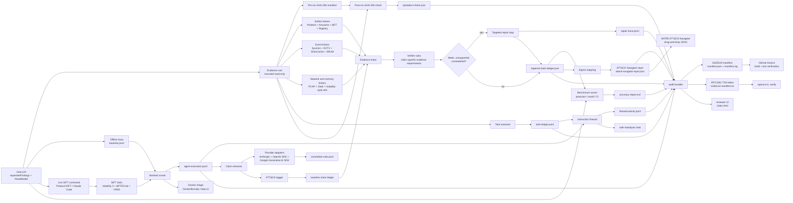

# Architecture Diagram

```mermaid
flowchart LR
  A["case.yml<br/>expectedFindings + threatModel"] --> B["Evidence root<br/>mounted read-only"]
  A --> C["Offline trace<br/>baseline.jsonl"]
  A --> D["Live SIFT command<br/>Protocol SIFT / Claude Code"]
  D --> D1["SIFT tools<br/>Volatility 3 + MFTECmd + YARA"]
  C --> E["Sentinel runner"]
  D1 --> E

  B --> L0["Pre-run SHA-256 manifest"]
  B --> L1["Artifact linkers<br/>Prefetch + Amcache + MFT + Registry"]
  B --> L2["Event linkers<br/>Sysmon + EVTX + ShimCache + SRUM"]
  B --> L3["Network and memory linkers<br/>PCAP + Zeek + Volatility-style refs"]
  B --> T0["Taint extractor"]

  E --> X0["agent-execution.jsonl"]
  X0 --> F0["Instruction firewall"]
  T0 --> T1["taint-ledger.jsonl"]
  T1 --> F0
  F0 --> F1["firewall-events.jsonl"]
  F0 --> F2["safe reanalysis task"]

  X0 --> C0["Claim extractor"]
  C0 --> C1["Provider adapters<br/>Anthropic + OpenAI SDK + Google Generative AI SDK"]
  C1 --> C2["committee-vote.jsonl"]
  C0 --> C3["ATT&CK tagger"]
  C3 --> C4["baseline claim ledger"]

  L1 --> V0["Evidence linker"]
  L2 --> V0
  L3 --> V0
  C4 --> V0
  V0 --> V1["Verifier rules<br/>claim-specific evidence requirements"]
  V1 --> R0{"Weak, unsupported,<br/>contradicted?"}
  R0 -- yes --> R1["Targeted repair loop"]
  R1 --> R2["repair-trace.jsonl"]
  R0 -- no --> G0["repaired claim-ledger.json"]
  R1 --> G0

  G0 --> S0["Benchmark scorer<br/>precision / recall / F1"]
  A --> S0
  S0 --> S1["accuracy-report.md"]

  G0 --> M0["Sigma mapping"]
  M0 --> M1["ATT&CK Navigator layer<br/>attack-navigator-layer.json"]

  B --> P0["Post-run SHA-256 check"]
  L0 --> P0
  P0 --> P1["spoliation-check.json"]

  S1 --> AB["audit-bundle/"]
  X0 --> AB
  G0 --> AB
  R2 --> AB
  F1 --> AB
  T1 --> AB
  P1 --> AB
  M1 --> AB
  AB --> AB1["Ed25519 manifest<br/>manifest.json + manifest.sig"]
  AB --> AB2["RFC3161 TSA token<br/>evidence-manifest.tsr"]
  AB --> AB3["reviewer UI<br/>index.html"]

  AB1 --> CI["GitHub Actions<br/>build + test verification"]
  AB2 --> OSSL["openssl ts -verify"]
  M1 --> NAV["MITRE ATT&CK Navigator<br/>drag-and-drop JSON"]
  E --> DOCKER["Docker image<br/>Dockerfile.kelp / kelp:v3"]
```
