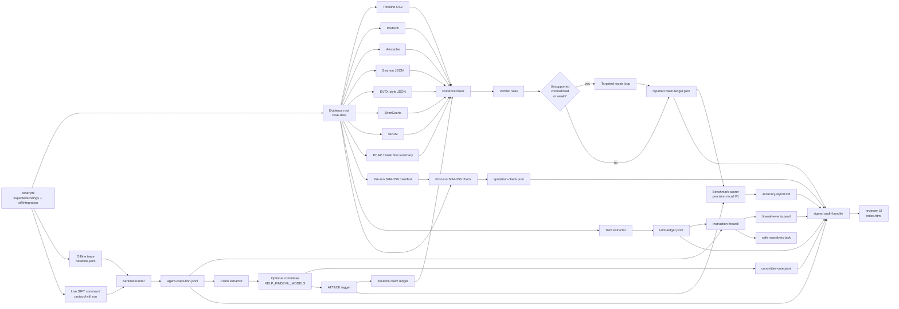

# Architecture Diagram

```mermaid
flowchart LR
  A["case.yml<br/>expectedFindings + siftIntegration"] --> B["Evidence root<br/>case-data"]
  A --> C["Offline trace<br/>baseline.jsonl"]
  A --> D["Live SIFT command<br/>protocol-sift run"]
  C --> E["Sentinel runner"]
  D --> E
  E --> F["agent-execution.jsonl"]

  B --> B1["Timeline CSV"]
  B --> B2["Prefetch"]
  B --> B3["Amcache"]
  B --> B4["Sysmon JSON"]
  B --> B5["EVTX-style JSON"]
  B --> B6["ShimCache"]
  B --> B7["SRUM"]
  B --> B8["PCAP / Zeek flow summary"]

  B --> G["Pre-run SHA-256 manifest"]
  B --> H["Taint extractor"]
  H --> I["taint-ledger.jsonl"]
  F --> J["Instruction firewall"]
  I --> J
  J --> K["firewall-events.jsonl"]
  J --> L["safe reanalysis task"]

  F --> M["Claim extractor"]
  M --> N["Optional committee<br/>KELP_FINDEVIL_MODELS"]
  N --> O["committee-vote.jsonl"]
  N --> P["ATT&CK tagger"]
  P --> Q["baseline claim ledger"]

  B1 --> R["Evidence linker"]
  B2 --> R
  B3 --> R
  B4 --> R
  B5 --> R
  B6 --> R
  B7 --> R
  B8 --> R
  Q --> R
  R --> S["Verifier rules"]
  S --> T{"Unsupported<br/>contradicted<br/>or weak?"}
  T -- yes --> U["Targeted repair loop"]
  U --> V["repaired claim-ledger.json"]
  T -- no --> V

  V --> W["Benchmark scorer<br/>precision recall F1"]
  P --> W
  W --> X["accuracy-report.md"]

  B --> Y["Post-run SHA-256 check"]
  G --> Y
  Y --> Z["spoliation-check.json"]

  X --> AA["signed audit-bundle/"]
  F --> AA
  I --> AA
  K --> AA
  O --> AA
  V --> AA
  Z --> AA
  AA --> AB["reviewer UI<br/>index.html"]
```
