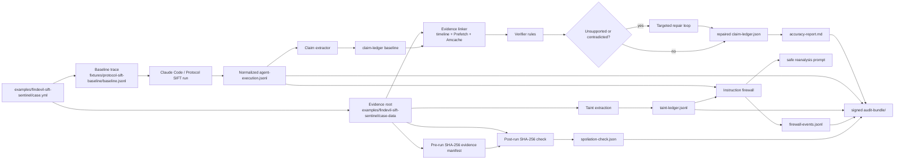

# Architecture Diagram

```mermaid
flowchart LR
  A["examples/findevil-sift-sentinel/case.yml"] --> B["Evidence root<br/>examples/findevil-sift-sentinel/case-data"]
  A --> C["Baseline trace<br/>fixtures/protocol-sift-baseline/baseline.jsonl"]
  C --> D["Claude Code / Protocol SIFT run"]
  B --> E["Pre-run SHA-256 evidence manifest"]
  B --> F["Taint extraction"]
  D --> G["Normalized agent-execution.jsonl"]
  F --> H["taint-ledger.jsonl"]
  G --> I["Instruction firewall"]
  H --> I
  I --> J["firewall-events.jsonl"]
  I --> K["safe reanalysis prompt"]
  G --> L["Claim extractor"]
  L --> M["claim-ledger baseline"]
  B --> N["Evidence linker<br/>timeline + Prefetch + Amcache"]
  M --> N
  N --> O["Verifier rules"]
  O --> P{"Unsupported or contradicted?"}
  P -- yes --> Q["Targeted repair loop"]
  Q --> R["repaired claim-ledger.json"]
  P -- no --> R
  R --> S["accuracy-report.md"]
  B --> T["Post-run SHA-256 check"]
  E --> T
  T --> U["spoliation-check.json"]
  S --> V["signed audit-bundle/"]
  G --> V
  H --> V
  J --> V
  U --> V
```
