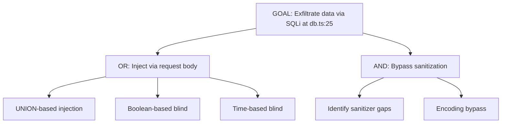
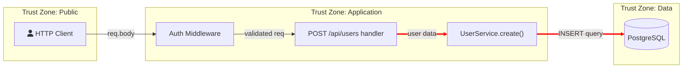

# Phase 38: Automated Threat Modeling

**Estimated effort: 45-60 ideal hours**
**Blocked by: Phase 37 (vuln DB — EPSS/exploit data feeds DREAD scoring), Phase 22 (advanced taint — DFD needs taint paths)**
**Blocks: Nothing (independent feature)**
**Target milestone: v0.7.0**

---

## 1. Overview

### 1.1 Goal

Automatically generate a threat model from Piranesi scan results. Classify findings into STRIDE categories, compute DREAD risk scores, generate attack trees for high-severity findings, and extract data flow diagrams from call graph data.

### 1.2 Design Principles

- **CLI-native**: all output to stdout or file. No web UI, no server.
- **Deterministic**: same scan results produce same threat model (no LLM in the loop unless explicitly requested).
- **Incremental value**: each sub-feature (STRIDE, DREAD, attack trees, DFD) is independently useful.
- **Composable**: threat model sections can be generated individually or combined into a full report.

### 1.3 Module Layout

```
src/piranesi/threat/
    __init__.py
    stride.py           # CWE → STRIDE mapping + classifier
    dread.py            # DREAD scoring engine
    attack_tree.py      # attack tree generation
    dfd.py              # data flow diagram extraction
    model.py            # threat model report orchestrator
```

---

## 2. STRIDE Classification

### 2.1 CWE → STRIDE Mapping

```python
# src/piranesi/threat/stride.py
from enum import Flag, auto

class StrideCategory(Flag):
    SPOOFING = auto()
    TAMPERING = auto()
    REPUDIATION = auto()
    INFORMATION_DISCLOSURE = auto()
    DENIAL_OF_SERVICE = auto()
    ELEVATION_OF_PRIVILEGE = auto()

# mapping table: CWE ID → STRIDE categories (multiple possible)
CWE_STRIDE_MAP: dict[str, StrideCategory] = {
    # spoofing
    "CWE-287": StrideCategory.SPOOFING,                          # improper authentication
    "CWE-306": StrideCategory.SPOOFING,                          # missing auth for critical function
    "CWE-352": StrideCategory.SPOOFING | StrideCategory.TAMPERING, # CSRF
    "CWE-384": StrideCategory.SPOOFING | StrideCategory.REPUDIATION, # session fixation
    "CWE-798": StrideCategory.SPOOFING,                          # hardcoded credentials
    "CWE-345": StrideCategory.SPOOFING,                          # insufficient verification of data authenticity

    # tampering
    "CWE-89":  StrideCategory.TAMPERING | StrideCategory.INFORMATION_DISCLOSURE, # SQLi
    "CWE-79":  StrideCategory.TAMPERING,                         # XSS
    "CWE-78":  StrideCategory.TAMPERING | StrideCategory.ELEVATION_OF_PRIVILEGE, # OS command injection
    "CWE-94":  StrideCategory.TAMPERING | StrideCategory.ELEVATION_OF_PRIVILEGE, # code injection
    "CWE-915": StrideCategory.TAMPERING,                         # mass assignment
    "CWE-434": StrideCategory.TAMPERING | StrideCategory.ELEVATION_OF_PRIVILEGE, # unrestricted file upload
    "CWE-611": StrideCategory.TAMPERING | StrideCategory.INFORMATION_DISCLOSURE, # XXE

    # repudiation
    "CWE-778": StrideCategory.REPUDIATION,                       # insufficient logging

    # information disclosure
    "CWE-22":  StrideCategory.INFORMATION_DISCLOSURE,             # path traversal
    "CWE-918": StrideCategory.INFORMATION_DISCLOSURE,             # SSRF
    "CWE-327": StrideCategory.INFORMATION_DISCLOSURE,             # broken crypto
    "CWE-328": StrideCategory.INFORMATION_DISCLOSURE,             # weak hash
    "CWE-319": StrideCategory.INFORMATION_DISCLOSURE,             # cleartext transmission
    "CWE-200": StrideCategory.INFORMATION_DISCLOSURE,             # exposure of sensitive info
    "CWE-209": StrideCategory.INFORMATION_DISCLOSURE,             # error message info leak
    "CWE-532": StrideCategory.INFORMATION_DISCLOSURE,             # insertion of sensitive info into log
    "CWE-295": StrideCategory.INFORMATION_DISCLOSURE | StrideCategory.SPOOFING, # improper cert validation
    "CWE-326": StrideCategory.INFORMATION_DISCLOSURE,             # inadequate encryption strength
    "CWE-338": StrideCategory.INFORMATION_DISCLOSURE | StrideCategory.SPOOFING, # weak PRNG
    "CWE-347": StrideCategory.INFORMATION_DISCLOSURE | StrideCategory.SPOOFING, # improper JWT verification

    # denial of service
    "CWE-1333": StrideCategory.DENIAL_OF_SERVICE,                 # ReDoS
    "CWE-400":  StrideCategory.DENIAL_OF_SERVICE,                 # resource exhaustion
    "CWE-770":  StrideCategory.DENIAL_OF_SERVICE,                 # allocation without limits
    "CWE-835":  StrideCategory.DENIAL_OF_SERVICE,                 # infinite loop

    # elevation of privilege
    "CWE-639": StrideCategory.ELEVATION_OF_PRIVILEGE,             # IDOR
    "CWE-269": StrideCategory.ELEVATION_OF_PRIVILEGE,             # improper privilege management
    "CWE-502": StrideCategory.ELEVATION_OF_PRIVILEGE | StrideCategory.TAMPERING, # deserialization
    "CWE-863": StrideCategory.ELEVATION_OF_PRIVILEGE,             # incorrect authorization
    "CWE-862": StrideCategory.ELEVATION_OF_PRIVILEGE,             # missing authorization
}
```

### 2.2 Classifier API

```python
def classify_stride(finding: CandidateFinding) -> StrideCategory:
    """Classify a finding into STRIDE categories.
    
    Lookup by vuln_class (CWE ID). Falls back to heuristic based on
    sink_type and source_type if CWE not in mapping table.
    Returns a StrideCategory flag (may have multiple bits set).
    """

def classify_all(findings: Sequence[CandidateFinding]) -> dict[str, StrideCategory]:
    """Classify all findings. Returns {finding.id: StrideCategory}."""

def stride_breakdown(
    classifications: dict[str, StrideCategory],
) -> dict[StrideCategory, list[str]]:
    """Invert mapping: {category: [finding_ids]}."""
```

### 2.3 Fallback Heuristics

When `vuln_class` is not in `CWE_STRIDE_MAP`:
- `sink_type == "sql_query"` → TAMPERING | INFORMATION_DISCLOSURE
- `sink_type == "command_execution"` → TAMPERING | ELEVATION_OF_PRIVILEGE
- `sink_type == "file_write"` → TAMPERING
- `sink_type == "http_response"` → INFORMATION_DISCLOSURE
- `source_type == "dependency_manifest"` → varies by advisory CWE from Phase 37 DB
- Default: INFORMATION_DISCLOSURE (conservative)

---

## 3. DREAD Scoring

### 3.1 Scoring Dimensions

Each dimension scored 1-10. Total raw score: 5-50, normalized to 0-10.

```python
# src/piranesi/threat/dread.py
@dataclass(frozen=True)
class DreadScore:
    damage: int             # 1-10
    reproducibility: int    # 1-10
    exploitability: int     # 1-10
    affected_users: int     # 1-10
    discoverability: int    # 1-10

    @property
    def total(self) -> int:
        return self.damage + self.reproducibility + self.exploitability + self.affected_users + self.discoverability

    @property
    def normalized(self) -> float:
        return round(self.total / 5.0, 1)

    @property
    def risk_level(self) -> str:
        n = self.normalized
        if n >= 8.0: return "critical"
        if n >= 6.0: return "high"
        if n >= 4.0: return "medium"
        return "low"
```

### 3.2 Scoring Rules

**Damage** (based on CWE severity + data sensitivity):

| Condition | Score |
|-----------|-------|
| CWE severity critical + PII/financial data in path | 10 |
| CWE severity critical | 9 |
| CWE severity high + PII in path | 8 |
| CWE severity high | 7 |
| CWE severity medium + PII in path | 6 |
| CWE severity medium | 5 |
| CWE severity low | 3 |
| Informational | 1 |

**Reproducibility** (based on verification result):

| Condition | Score |
|-----------|-------|
| Docker-confirmed exploit | 10 |
| LLM confirmed, high confidence (>= 0.9) | 8 |
| Likely (confidence >= 0.7) | 7 |
| Possible (confidence >= 0.5) | 5 |
| Unverifiable / low confidence | 3 |

**Exploitability** (based on attack complexity):

| Condition | Score |
|-----------|-------|
| Direct user input → sink (no auth, no intermediate steps) | 10 |
| Direct user input → sink (requires auth) | 7 |
| Multi-step taint path (>3 steps) | 5 |
| Requires specific conditions / path constraints | 3 |
| Dependency vulnerability (indirect) | 4 |
| EPSS >= 0.5 (from Phase 37) | +2 (capped at 10) |
| Exploit status: in_the_wild / weaponized (from Phase 37) | +3 (capped at 10) |

**Affected Users** (based on endpoint exposure):

| Condition | Score |
|-----------|-------|
| Public unauthenticated route (GET/POST, no auth middleware) | 10 |
| Public authenticated route | 7 |
| Admin-only route | 3 |
| Internal/private function (no route) | 2 |
| Dependency vulnerability in production dep | 8 |
| Dependency vulnerability in devDependency | 2 |

**Discoverability** (based on attack surface visibility):

| Condition | Score |
|-----------|-------|
| Direct HTTP route, documented in OpenAPI/Swagger | 10 |
| Direct HTTP route, not documented | 8 |
| WebSocket / event handler | 6 |
| Internal function reachable from route | 5 |
| Deeply nested internal function | 3 |
| Obfuscated / minified code path | 2 |

### 3.3 Scorer API

```python
def score_dread(
    finding: CandidateFinding,
    *,
    entry_points: Sequence[EntryPoint] | None = None,
    verification_result: object | None = None,
) -> DreadScore:
    """Compute DREAD score for a single finding."""

def score_all(
    findings: Sequence[CandidateFinding],
    *,
    entry_points: Sequence[EntryPoint] | None = None,
    verification_results: dict[str, object] | None = None,
) -> dict[str, DreadScore]:
    """Compute DREAD scores for all findings. Returns {finding.id: DreadScore}."""
```

---

## 4. Attack Tree Generation

### 4.1 Tree Structure

```python
# src/piranesi/threat/attack_tree.py
@dataclass
class AttackNode:
    label: str
    node_type: Literal["goal", "and", "or", "leaf"]
    children: list[AttackNode] = field(default_factory=list)
    metadata: dict[str, str] = field(default_factory=dict)
```

### 4.2 Generation Logic

For each finding, construct a tree based on the vulnerability class:

**SQLi (CWE-89) template:**
```
[GOAL] Exfiltrate data via SQL injection at {sink_location}
├── [OR] Inject via {source_type}
│   ├── [LEAF] UNION-based injection (extract additional tables)
│   ├── [LEAF] Boolean-based blind injection (binary search extraction)
│   ├── [LEAF] Time-based blind injection (SLEEP/BENCHMARK timing)
│   └── [LEAF] Error-based injection (verbose SQL error messages)
├── [AND] Bypass sanitization
│   ├── [LEAF] Identify sanitizer gaps ({sanitizers_on_path})
│   └── [LEAF] Encoding bypass (URL-encode, Unicode, double-encode)
└── [AND] Escalate access
    ├── [LEAF] Read sensitive tables (users, credentials, tokens)
    ├── [LEAF] Write/modify data (UPDATE/INSERT via stacked queries)
    └── [LEAF] OS command execution (xp_cmdshell, LOAD_FILE, INTO OUTFILE)
```

**XSS (CWE-79) template:**
```
[GOAL] Execute arbitrary JavaScript via XSS at {sink_location}
├── [OR] Inject payload via {source_type}
│   ├── [LEAF] Reflected XSS (URL parameter → response body)
│   ├── [LEAF] Stored XSS (persist payload in database → render to other users)
│   └── [LEAF] DOM-based XSS (client-side sink without server round-trip)
├── [AND] Bypass output encoding
│   ├── [LEAF] Context escape (break out of HTML attribute/JS string/CSS)
│   └── [LEAF] Encoding bypass (HTML entities, JS Unicode escapes)
└── [AND] Achieve impact
    ├── [LEAF] Session hijacking (steal cookies via document.cookie)
    ├── [LEAF] Credential theft (inject fake login form)
    ├── [LEAF] Keylogging (addEventListener on input fields)
    └── [LEAF] CSRF via XSS (perform actions as victim)
```

**Command Injection (CWE-78) template:**
```
[GOAL] Execute OS commands via injection at {sink_location}
├── [OR] Inject via {source_type}
│   ├── [LEAF] Shell metacharacter injection (; | && || ` $())
│   ├── [LEAF] Argument injection (-- prefix, flag injection)
│   └── [LEAF] Environment variable injection (PATH manipulation)
├── [AND] Bypass filters
│   ├── [LEAF] Identify allowed characters
│   └── [LEAF] Encoding bypass (hex, octal, ${IFS} for spaces)
└── [AND] Escalate
    ├── [LEAF] Reverse shell (nc/bash/python one-liner)
    ├── [LEAF] File read/write (cat /etc/passwd, write webshell)
    └── [LEAF] Privilege escalation (sudo misconfig, SUID binaries)
```

Additional templates for: path traversal (CWE-22), SSRF (CWE-918), deserialization (CWE-502), IDOR (CWE-639).

### 4.3 Parameterization

Templates are parameterized with finding-specific data:
- `{sink_location}`: file:line from `finding.sink.location`.
- `{source_type}`: from `finding.source.source_type`.
- `{sanitizers_on_path}`: from entry point's `sanitizers_on_path` if available.
- `{taint_path_length}`: `len(finding.taint_path)`.

### 4.4 Output Formats

**Markdown (indented list):**
```markdown
- **GOAL**: Exfiltrate data via SQL injection at db.ts:25
  - **OR**: Inject via HTTP request body
    - UNION-based injection (extract additional tables)
    - Boolean-based blind injection (binary search extraction)
    - Time-based blind injection (SLEEP/BENCHMARK timing)
  - **AND**: Bypass sanitization
    - Identify sanitizer gaps (none detected)
    - Encoding bypass (URL-encode, Unicode, double-encode)
```

**JSON:**
```json
{
    "label": "Exfiltrate data via SQL injection at db.ts:25",
    "node_type": "goal",
    "children": [
        {
            "label": "Inject via HTTP request body",
            "node_type": "or",
            "children": [
                {"label": "UNION-based injection", "node_type": "leaf", "children": []}
            ]
        }
    ]
}
```

**Mermaid diagram:**


### 4.5 CLI

```
piranesi threat tree --finding-id <id> --format markdown    # default
piranesi threat tree --finding-id <id> --format json
piranesi threat tree --finding-id <id> --format mermaid
piranesi threat tree --top 5 --format mermaid               # top 5 by DREAD score
```

---

## 5. Data Flow Diagram Extraction

### 5.1 DFD Elements

```python
# src/piranesi/threat/dfd.py
@dataclass
class DfdElement:
    id: str
    label: str
    element_type: Literal["external_entity", "process", "data_store", "trust_boundary"]
    metadata: dict[str, str] = field(default_factory=dict)

@dataclass
class DfdFlow:
    source_id: str
    target_id: str
    label: str
    is_tainted: bool = False          # taint path crosses this flow
    crosses_trust_boundary: bool = False
```

### 5.2 Element Extraction

From Piranesi scan results + entry point data:

| DFD Element | Source |
|-------------|--------|
| External entities | HTTP clients (inferred from route handlers), WebSocket clients, external API consumers |
| Processes | Route handlers, middleware functions, service functions, background workers |
| Data stores | Database connections (identified by sink_type: `sql_query`, `nosql_query`), file system ops (`file_read`, `file_write`), cache (Redis/Memcached calls) |
| Trust boundaries | Auth middleware positions (JWT verify, session check), network boundaries (internal vs external routes), input validation middleware |

### 5.3 Trust Boundary Detection

Heuristics for trust boundary placement:
1. **Auth middleware**: if a route handler has `auth`, `authenticate`, `requireAuth`, `passport`, `jwt.verify` in its middleware chain → trust boundary before that middleware.
2. **Input validation**: `express-validator`, `joi.validate`, `zod.parse` → trust boundary at validation point.
3. **Network boundary**: routes on different ports or prefixes (`/api/internal/` vs `/api/public/`) → separate trust zones.
4. **Service boundary**: cross-module calls (different `package.json` in monorepo) → trust boundary.

### 5.4 Taint Path Overlay

For each finding's taint path:
1. Map taint source → DFD element (external entity or process).
2. Map each taint step → DFD flow between processes.
3. Map taint sink → DFD element (data store or process).
4. Mark flows as `is_tainted = True`.
5. Check if any tainted flow crosses a trust boundary → `crosses_trust_boundary = True`.

Findings where taint crosses a trust boundary are flagged as higher risk (feeds into DREAD discoverability score).

### 5.5 Output Format

**Mermaid flowchart:**


Tainted flows rendered in red (Mermaid `linkStyle` with `stroke:red`).

**JSON:**
```json
{
    "elements": [
        {"id": "ext1", "label": "HTTP Client", "element_type": "external_entity"},
        {"id": "p1", "label": "POST /api/users handler", "element_type": "process"},
        {"id": "ds1", "label": "PostgreSQL", "element_type": "data_store"}
    ],
    "flows": [
        {"source_id": "ext1", "target_id": "p1", "label": "req.body", "is_tainted": true},
        {"source_id": "p1", "target_id": "ds1", "label": "INSERT query", "is_tainted": true, "crosses_trust_boundary": true}
    ],
    "trust_boundaries": [
        {"id": "tb1", "label": "Public", "element_ids": ["ext1"]},
        {"id": "tb2", "label": "Application", "element_ids": ["p1"]},
        {"id": "tb3", "label": "Data", "element_ids": ["ds1"]}
    ]
}
```

### 5.6 CLI

```
piranesi threat dfd --output dfd.md                 # Mermaid in markdown file
piranesi threat dfd --format json --output dfd.json  # JSON
piranesi threat dfd                                  # Mermaid to stdout
piranesi threat dfd --taint-overlay                  # highlight tainted flows (default: on)
piranesi threat dfd --no-taint-overlay               # plain DFD without taint highlighting
```

---

## 6. Threat Model Report

### 6.1 CLI

```
piranesi threat model                                   # full threat model to stdout
piranesi threat model --output threat-model.md          # to file
piranesi threat model --format json --output model.json # JSON output
piranesi threat model --top 5                           # attack trees for top 5 only
piranesi threat model --findings findings.json          # from saved findings
```

### 6.2 Report Sections

The full threat model report contains:

**1. Executive Summary**
```
Threat Model Summary
  Findings analyzed:    18
  STRIDE breakdown:     S:2  T:8  R:0  I:5  D:1  E:3
  DREAD critical (>=8): 3
  DREAD high (>=6):     7
  Top threat:           SQL Injection in POST /api/users (DREAD: 8.4)
```

**2. STRIDE Breakdown**

Rich table grouping findings by STRIDE category:
```
STRIDE Classification
  Category                  Count  Findings
  ────────────────────────────────────────────────
  Spoofing                  2      #3 (CWE-287), #7 (CWE-352)
  Tampering                 8      #1 (CWE-89), #2 (CWE-79), ...
  Repudiation               0      —
  Information Disclosure    5      #4 (CWE-22), #5 (CWE-918), ...
  Denial of Service         1      #9 (CWE-1333)
  Elevation of Privilege    3      #6 (CWE-502), #8 (CWE-639), ...
```

**3. DREAD Priority List**

Findings sorted by DREAD normalized score, descending:
```
DREAD Risk Priority
  Rank  Finding  CWE      DREAD  D  R  E  A  D   Risk
  ──────────────────────────────────────────────────────
  1     #1       CWE-89   8.4    9  10 8  10 5    critical
  2     #6       CWE-502  7.8    8  8  7  8  8    high
  3     #2       CWE-79   7.2    7  8  10 7  4    high
  ...
```

**4. Top Attack Trees**

Attack trees for the top N findings (default 5) by DREAD score.

**5. Data Flow Diagram**

Full DFD with taint overlay.

**6. Risk Matrix**

STRIDE category × DREAD severity heatmap:
```
Risk Matrix (STRIDE × DREAD Severity)
              critical  high  medium  low
  Spoofing        0       1      1     0
  Tampering       2       3      2     1
  Repudiation     0       0      0     0
  Info Disc.      1       2      2     0
  DoS             0       0      1     0
  Elev. Priv.     0       2      1     0
```

Rendered as a Rich table with color-coded cells (red for critical, yellow for high, etc.).

### 6.3 Report Orchestrator

```python
# src/piranesi/threat/model.py
def generate_threat_model(
    findings: Sequence[CandidateFinding],
    *,
    entry_points: Sequence[EntryPoint] | None = None,
    verification_results: dict[str, object] | None = None,
    top_n: int = 5,
    format: Literal["markdown", "json"] = "markdown",
) -> str:
    """Generate full threat model report.
    
    1. STRIDE classify all findings.
    2. DREAD score all findings.
    3. Generate attack trees for top_n findings.
    4. Extract DFD from entry points and findings.
    5. Render report in requested format.
    """
```

---

## 7. Tests

### 7.1 STRIDE Mapping

```python
# tests/test_threat/test_stride.py
@pytest.mark.parametrize("cwe,expected_categories", [
    ("CWE-89", StrideCategory.TAMPERING | StrideCategory.INFORMATION_DISCLOSURE),
    ("CWE-79", StrideCategory.TAMPERING),
    ("CWE-352", StrideCategory.SPOOFING | StrideCategory.TAMPERING),
    ("CWE-502", StrideCategory.ELEVATION_OF_PRIVILEGE | StrideCategory.TAMPERING),
    ("CWE-1333", StrideCategory.DENIAL_OF_SERVICE),
    ("CWE-639", StrideCategory.ELEVATION_OF_PRIVILEGE),
])
def test_cwe_stride_mapping(cwe, expected_categories):
    finding = make_finding(vuln_class=cwe)
    assert classify_stride(finding) == expected_categories

def test_unknown_cwe_fallback():
    """CWE not in mapping table falls back to heuristic."""
    finding = make_finding(vuln_class="CWE-999999", sink_type="sql_query")
    result = classify_stride(finding)
    assert StrideCategory.TAMPERING in result

def test_stride_breakdown_groups_correctly():
    """Verify stride_breakdown inverts classifications."""
    classifications = {"f1": StrideCategory.TAMPERING, "f2": StrideCategory.TAMPERING | StrideCategory.SPOOFING}
    breakdown = stride_breakdown(classifications)
    assert "f1" in breakdown[StrideCategory.TAMPERING]
    assert "f2" in breakdown[StrideCategory.TAMPERING]
    assert "f2" in breakdown[StrideCategory.SPOOFING]
```

### 7.2 DREAD Scoring

```python
# tests/test_threat/test_dread.py
def test_high_severity_public_route_scores_high():
    """Critical SQLi on public route should score >= 8.0 normalized."""
    finding = make_finding(vuln_class="CWE-89", severity="critical", confidence=0.95)
    entry = make_entry_point(kind="route", http_method="POST", route_pattern="/api/public")
    score = score_dread(finding, entry_points=[entry])
    assert score.normalized >= 8.0
    assert score.risk_level == "critical"

def test_low_severity_internal_scores_low():
    """Low-severity finding on internal function should score < 4.0."""
    finding = make_finding(vuln_class="CWE-200", severity="low", confidence=0.5)
    score = score_dread(finding, entry_points=[])
    assert score.normalized < 4.0
    assert score.risk_level == "low"

def test_epss_boosts_exploitability():
    """EPSS >= 0.5 should increase exploitability dimension."""
    finding = make_finding(vuln_class="CWE-89", severity="high", metadata={"epss_score": 0.6})
    score = score_dread(finding)
    assert score.exploitability >= 8

def test_dread_score_range():
    """All dimensions 1-10, total 5-50, normalized 1.0-10.0."""
    finding = make_finding(vuln_class="CWE-79", severity="medium")
    score = score_dread(finding)
    for dim in [score.damage, score.reproducibility, score.exploitability, score.affected_users, score.discoverability]:
        assert 1 <= dim <= 10
    assert 1.0 <= score.normalized <= 10.0
```

### 7.3 Attack Tree Generation

```python
# tests/test_threat/test_attack_tree.py
def test_sqli_tree_structure():
    """SQLi finding produces tree with UNION/blind/time-based leaves."""
    finding = make_finding(vuln_class="CWE-89")
    tree = generate_attack_tree(finding)
    assert tree.node_type == "goal"
    assert any(child.node_type == "or" for child in tree.children)
    leaf_labels = _collect_leaves(tree)
    assert any("UNION" in label for label in leaf_labels)
    assert any("blind" in label.lower() for label in leaf_labels)

def test_xss_tree_structure():
    """XSS finding produces tree with reflected/stored/DOM leaves."""
    finding = make_finding(vuln_class="CWE-79")
    tree = generate_attack_tree(finding)
    leaf_labels = _collect_leaves(tree)
    assert any("Reflected" in label for label in leaf_labels)
    assert any("Stored" in label for label in leaf_labels)

def test_mermaid_output_valid():
    """Mermaid output contains graph TD and node definitions."""
    finding = make_finding(vuln_class="CWE-89")
    tree = generate_attack_tree(finding)
    mermaid = render_tree(tree, format="mermaid")
    assert mermaid.startswith("graph TD")
    assert "-->" in mermaid

def test_json_output_roundtrip():
    """JSON output can be deserialized back to AttackNode."""
    finding = make_finding(vuln_class="CWE-78")
    tree = generate_attack_tree(finding)
    json_str = render_tree(tree, format="json")
    parsed = json.loads(json_str)
    assert parsed["node_type"] == "goal"
    assert len(parsed["children"]) > 0
```

### 7.4 DFD Extraction

```python
# tests/test_threat/test_dfd.py
def test_dfd_elements_from_entry_points():
    """Entry points produce process elements + external entity."""
    entries = [make_entry_point(kind="route", http_method="POST", route_pattern="/api/users")]
    dfd = extract_dfd(findings=[], entry_points=entries)
    types = {e.element_type for e in dfd.elements}
    assert "external_entity" in types
    assert "process" in types

def test_dfd_data_store_from_sql_sink():
    """Finding with sql_query sink produces data_store element."""
    finding = make_finding(vuln_class="CWE-89", sink_type="sql_query")
    dfd = extract_dfd(findings=[finding], entry_points=[])
    types = {e.element_type for e in dfd.elements}
    assert "data_store" in types

def test_taint_overlay_marks_flows():
    """Tainted finding marks corresponding DFD flows as tainted."""
    finding = make_finding(vuln_class="CWE-89")
    entry = make_entry_point(kind="route")
    dfd = extract_dfd(findings=[finding], entry_points=[entry])
    tainted_flows = [f for f in dfd.flows if f.is_tainted]
    assert len(tainted_flows) > 0

def test_trust_boundary_detection():
    """Auth middleware creates trust boundary in DFD."""
    entry = make_entry_point(kind="route", middleware=["authenticate", "validateInput"])
    dfd = extract_dfd(findings=[], entry_points=[entry])
    boundaries = [e for e in dfd.elements if e.element_type == "trust_boundary"]
    assert len(boundaries) > 0

def test_mermaid_dfd_output():
    """Mermaid output contains subgraph for trust zones."""
    finding = make_finding(vuln_class="CWE-89")
    entry = make_entry_point(kind="route")
    dfd = extract_dfd(findings=[finding], entry_points=[entry])
    mermaid = render_dfd(dfd, format="mermaid")
    assert "subgraph" in mermaid
    assert "graph" in mermaid
```

### 7.5 Full Threat Model

```python
# tests/test_threat/test_model.py
def test_full_threat_model_contains_all_sections():
    """Full report has executive summary, STRIDE, DREAD, trees, DFD, matrix."""
    findings = [make_finding(vuln_class="CWE-89"), make_finding(vuln_class="CWE-79")]
    report = generate_threat_model(findings, top_n=2)
    assert "Threat Model Summary" in report
    assert "STRIDE" in report
    assert "DREAD" in report
    assert "Attack Tree" in report or "GOAL" in report
    assert "Risk Matrix" in report

def test_json_format_parseable():
    """JSON format output is valid JSON with expected keys."""
    findings = [make_finding(vuln_class="CWE-89")]
    report = generate_threat_model(findings, format="json")
    parsed = json.loads(report)
    assert "stride" in parsed
    assert "dread" in parsed
    assert "attack_trees" in parsed
    assert "dfd" in parsed
```

---

## 8. Risks

| Risk | Likelihood | Impact | Mitigation |
|------|------------|--------|------------|
| STRIDE mapping incompleteness | Medium | Some CWEs unclassified | Fallback heuristics by sink_type, extensible mapping table |
| DREAD scoring subjectivity | High | Scores may not match org's risk appetite | Configurable dimension weights in `piranesi.toml`, override per-finding |
| Attack tree template rigidity | Medium | Not all attack scenarios covered | Template per CWE class, generic fallback template, extensible via plugin |
| DFD accuracy | High | Trust boundaries may be misplaced | Heuristic-based, documented limitations, user can override via annotations |
| Large finding sets slow tree generation | Low | Report generation >10s | Generate trees for top N only (default 5), lazy generation |
