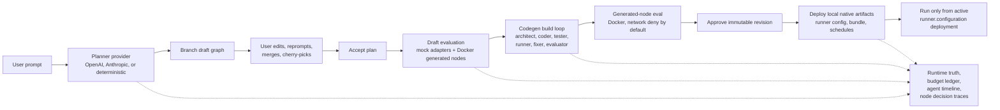

# KelpClaw Quickstart

This guide starts the local KelpClaw stack and walks through the runtime stages OpenClaw now shows explicitly.

## 1. Configure

```console
$ cp .env.example .env
```

Edit `.env` before starting:

- Set `KELPCLAW_ADMIN_TOKEN` to a non-placeholder value.
- Set `KELPCLAW_SECRET_MASTER_KEY` to a strong non-placeholder value.
- Keep `KELPCLAW_PLANNER_MODE=deterministic` for an offline smoke test, or enable one live provider block.

OpenAI-only live mode:

```dotenv
KELPCLAW_PLANNER_MODE=live
KELPCLAW_PLANNER_PROVIDER=openai
KELPCLAW_AGENTIC_PROVIDER=openai
KELPCLAW_CODEGEN_PROVIDER=openai
OPENAI_API_KEY=sk-...
```

Anthropic-only live mode:

```dotenv
KELPCLAW_PLANNER_MODE=live
KELPCLAW_PLANNER_PROVIDER=anthropic
KELPCLAW_AGENTIC_PROVIDER=anthropic
KELPCLAW_CODEGEN_PROVIDER=anthropic
ANTHROPIC_API_KEY=sk-ant-...
```

## 2. Start With Docker

```console
$ docker compose up --build
```

OpenClaw runs at `http://127.0.0.1:5173`. The API runs at `http://127.0.0.1:8787`.

The Docker preflight blocks startup before the API server runs if the admin token, secret master key, selected provider key, Docker socket, or workspace mounts are invalid. Fix `.env`, then run Compose again.

## 3. First Deployed Workflow

1. Open OpenClaw.
2. Press `Cmd+P` on macOS or `Ctrl+P` elsewhere.
3. Run `Plan Workflow`, enter a prompt, and answer clarification questions if prompted.
4. Edit the graph if needed.
5. Click `Accept Plan`.
6. Click `Evaluate`.
7. Click `Approve`.
8. Click `Deploy`.
9. Click `Run`.

`Run` stays disabled until there is an active `runner.configuration` deployment for the approved revision. Local deployment means KelpClaw has created local activation/config/artifact records; it does not provision cloud infrastructure.

## Runtime Truth

OpenClaw distinguishes these stages:

- `Planned`: a draft graph exists.
- `Accepted`: the user accepted the plan shape.
- `Generated`: generated-code artifacts exist where required.
- `Evaluated`: draft/codegen eval gates passed.
- `Approved`: an immutable approved revision exists.
- `Deployed`: local deployment records/artifacts exist.
- `Runnable`: an active `runner.configuration` deployment exists and production runs can start.

## Budgets And Providers

OpenClaw reads provider status from `/api/runtime/providers` and budget state from `/api/workflows/:id/budget`. Live provider calls are hard-stopped before the next agent step when the projected cost would exceed the configured budget.

Default budgets:

- Workflow: `$5.00`
- Generated-node build: `$2.00`
- Agentic research: `$2.00`
- Expensive retry confirmation threshold: `$0.25`

## Architecture



## Auditability Boundary

KelpClaw stores structured per-node decision traces: rationale summaries, alternatives considered, tool/model calls, artifact refs, eval outcomes, tokens, and cost. It does not store raw hidden chain-of-thought.
